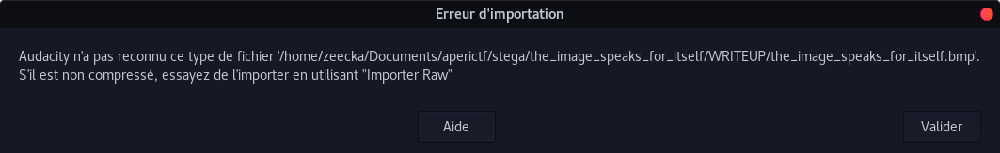
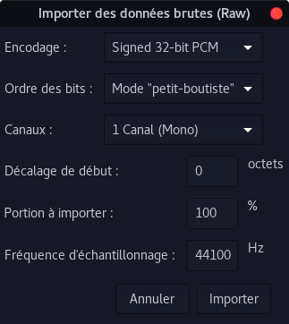
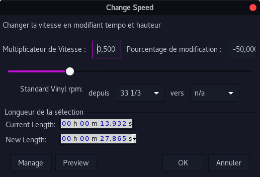
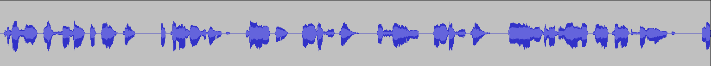

## L’image parle d’elle même

### Détails du challenge

Points : 100<br/>
Catégorie :  Stéganographie<br/>
Fichier : [the_image_speaks_for_itself.bmp](https://ctf.ineat.fr/files/a9c6f402ece956ed6c0ed98e1caec601/the_image_speaks_for_itself.bmp)<br/>

```text
Trouvez le flag.  
Ici c’est relativement simple: l’image parle d’elle même.
```
### TL;DR
Ouvrir le fichier en tant que données brutes dans Audacity et écouter le flag.

### Méthodologie

#### Analyse
Dans ce défi, nous avons deux astuces:
- Le nom du défi qui dit "parle"
- Le contenu visuel du fichier BMP qui est une table de mixage de son.

Les indices convergent vers un fichier son.

La première chose à faire est d'ouvrir le fichier BMP avec Audacity (glisser-déposer). J'ai eu l'erreur suivante:
<center></center><br>

L'erreur suggère d'importer le fichier brut: "Import Raw".
J'ai importé le fichier comme suit: File > Import > Import Raw

<center></center><br>

Le texte est un peu trop rapide, ralentissons-le (Effets> Changer la vitesse):

<center><br>
<br>
</center><br>

Jouons le son :
```text
Bravo, le flag est APRK{BMP_PCM_POLYGLOT}, le tout en majuscule.
```
#### Flag

`APRK{BMP_PCM_POLYGLOT}`
