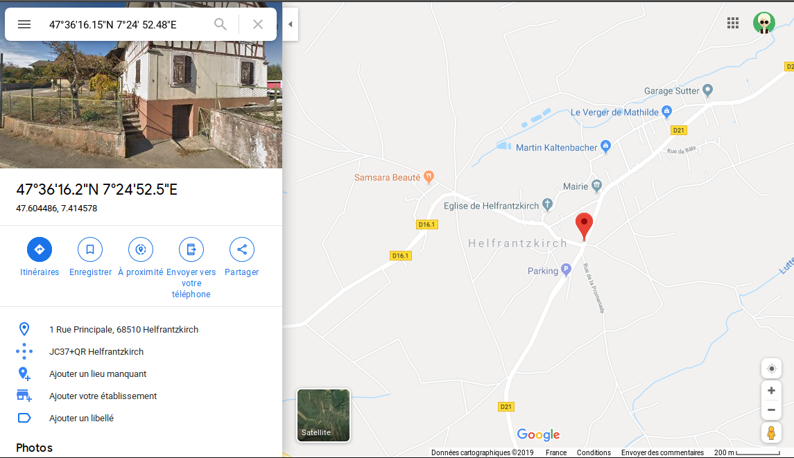

# Ravisseur

On arrive ici dans mon challenge préféré. 

Nous avons donc un fichier chat.zip qui, une fois dézippé, nous sort un fichier `chat`
 sans extension. Une petite inspection s'impose :
 
```bash
$ file chat
chat: DOS/MBR boot sector; partition 1 : ID=0xb, start-CHS (0x0,32,33), end-CHS (0x10,81,1), startsector 2048, 260096 sectors, extended partition table (last)
```

On est donc apparemment face à un fichier disque, ce qui colle plutot bien avec notre histoire de clé USB.

Une façon très simple de le vérifier, le MBR ([Master Boot Record]) occupe toujours le secteur zero du disque. Et le MBR a la particularité de posséder par sécurité au 510ème octet un "nombre magique" qui vaut `0xAA55`.

```text
$ hexdump chat | head -n 33
0000000 0000 0000 0000 0000 0000 0000 0000 0000
*
00001b0 0000 0000 0000 0000 543f c5ce 0000 2000
00001c0 0021 510b 1001 0800 0000 f800 0003 0000
00001d0 0000 0000 0000 0000 0000 0000 0000 0000
*
00001f0 0000 0000 0000 0000 0000 0000 0000 aa55
0000200 0000 0000 0000 0000 0000 0000 0000 0000
*
0100000 58eb 6d90 646b 736f 7366 0000 0102 0020
0100010 0002 0000 f800 0000 0020 0040 0000 0000
0100020 f800 0003 07d1 0000 0000 0000 0002 0000
0100030 0001 0006 0000 0000 0000 0000 0000 0000
0100040 0000 5d29 43a8 209b 2020 2020 2020 2020
0100050 2020 4146 3354 2032 2020 1f0e 77be ac7c
0100060 c022 0b74 b456 bb0e 0007 10cd eb5e 32f0
0100070 cde4 cd16 eb19 54fe 6968 2073 7369 6e20
0100080 746f 6120 6220 6f6f 6174 6c62 2065 6964
0100090 6b73 202e 5020 656c 7361 2065 6e69 6573
01000a0 7472 6120 6220 6f6f 6174 6c62 2065 6c66
01000b0 706f 7970 6120 646e 0a0d 7270 7365 2073
01000c0 6e61 2079 656b 2079 6f74 7420 7972 6120
01000d0 6167 6e69 2e20 2e2e 0d20 000a 0000 0000
01000e0 0000 0000 0000 0000 0000 0000 0000 0000
*
01001f0 0000 0000 0000 0000 0000 0000 0000 aa55
0100200 5252 4161 0000 0000 0000 0000 0000 0000
0100210 0000 0000 0000 0000 0000 0000 0000 0000
*
01003e0 0000 0000 7272 6141 dd7c 0002 734b 0001
01003f0 0000 0000 0000 0000 0000 0000 0000 aa55 <-- magic number
0100400 0000 0000 0000 0000 0000 0000 0000 0000
```

Puisqu'on a un disque, le plus commode serait donc de le monter.  
Pour ça, on va regarder plus en détail ce que contient notre disque :

```text
$ fdisk -l chat
Disk chat: 128 MiB, 134217728 bytes, 262144 sectors
Units: sectors of 1 * 512 = 512 bytes
Sector size (logical/physical): 512 bytes / 512 bytes
I/O size (minimum/optimal): 512 bytes / 512 bytes
Disklabel type: dos
Disk identifier: 0xc5ce543f

Device Boot Start    End Sectors  Size Id Type
chat1        2048 262143  260096  127M  b W95 FAT32
```

On a donc une partition `chat 1` qui débute au secteur 2048. Chaque secteur faisant 512 octets, on va avoir besoin d'un offset (décalage)  de `512 * 2048 = 1 048 576 octets` pour la monter correctement.

Un petit tour dans `man mount` pour trouver les options fat et c'est parti :

```text
$ mkdir /tmp/test

$ sudo mount -t vfat -o rw,loop,offset=1048576,fat=32 chat /tmp/test <- on monte un loop device de type fat32 en lecture/ecriture (rw) sur /tmp/test

$ mount | grep /tmp/test
/dev/loop22 on /tmp/test type vfat (rw,relatime,fmask=0022,dmask=0022,codepage=437,iocharset=iso8859-1,shortname=mixed,errors=remount-ro)

$ lsblk | grep /tmp/test <- point de montage, facultatif puisqu'indiqué au dessus
loop22   7:22   0   127M  0 loop /tmp/test
```

On a donc maintenant le contenu de notre clé USB. Après de fastidieuses recherches, rien de concluant.  
On peut donc supposer que notre suspect aurait essayé de supprimer les preuves.

Sous linux, on peut utiliser photorec qui permet de récupérer facilement des fichiers supprimés.

```text
$ sudo photorec /dev/loop22
```

> Ici il est important d'avoir monté le disque en rw (read/write) et non en ro (read only) sinon impossible d'écrire les fichiers récupérés.

Et en effet on récupère plusieurs fichiers, notemment `f0019458.odt`


Rien d'intéressant dans le document, ni dans ses métadonnées. 
L'image par contre va nous en dire un peu plus.

```
$ exiftool cat.jpg
[...]
GPS Altitude                    : 16.7 m Above Sea Level
GPS Latitude                    : 47 deg 36' 16.15" N
GPS Longitude                   : 7 deg 24' 52.48" E
GPS Position                    : 47 deg 36' 16.15" N, 7 deg 24' 52.48" E
```

On sait donc précisément où la photo a été prise, et on sait maintenant que notre ravisseur se trouve dans la douce ville de Helfrantzkirch.



## FLAG 
`INEAT{helfrantzkirch}`

[Master Boot Record]:https://fr.wikipedia.org/wiki/Master_boot_record
